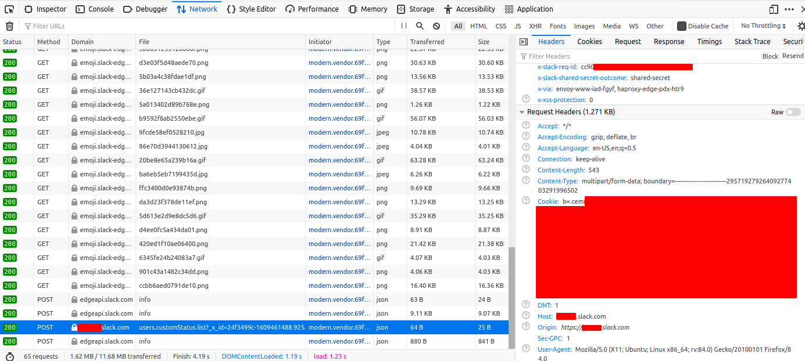

# massmoji

_Because you can never have too many Slack emojis_

Do YOU need Slack emojis? Well, this is the tool for you! Download all 10,000+ emojis from Slackmoji and automatically add them to your Slack workspace!

## Warning

This might violate Slack's EULA, not sure. User beware, I assume no liability, etc. etc. etc.

## Usage

Install dependencies with `pip`:

```
$ pip install -r requirements.txt
```

Then, get the Slackmoji download going, it takes about an hour:

```
$ python3 slackmoji_download.py
```

This downloads all of the emojis from Slackmoji into the `emoji/` folder. It will use approximately 259 MB of space.

Then, you need to setup your `secret.py` with your Slack details. Go to `https://yourslackworkspace.slack.com/customize/emoji`, open the Developer Tools and go to the Network tab, and refresh the page. Then, find a request where the Domain is `yourslackworkspace.slack.com`, and copy the value of the Cookie header in the Request Headers section.




Duplicate `secret.tmpl.py` to `secret.py`, and fill in the variables with the appropriate values.

Once the Slackmoji download finishes, you can upload everything to Slack:

```
$ python3 slack_upload.py
```

Please be patient as it processes all of the emojis, it will take a number of hours and will be severely rate limited by Slack.

## Issues

This was a quick project that I did in a few hours, and there are almost certainly bugs. Feel free to open an [issue](https://github.com/captainGeech42/massmoji/issues) if you have a bug with this script. It will probably break if Slack changes how this API works, so if it isn't working a few months/years from when this was uploaded, that's probably why.
